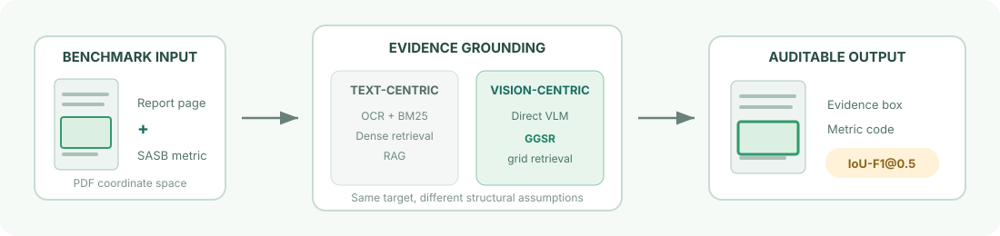

<div align="center">
  
</div>

<h1 align="center">Sustainable-VEG</h1>

<p align="center">
  <strong>A benchmark for fine-grained visual evidence grounding in sustainability reports</strong>
</p>

<p align="center">
  <a href="data/Sustainable-VEG.json"></a>
  <a href="data/README.md"></a>
  <a href="metrics"></a>
  <a href="LICENSE"></a>
  <a href="DATA_LICENSE"></a>
</p>

Sustainable-VEG evaluates whether a system can locate the *minimal visual evidence* that supports a standardized SASB disclosure. Each benchmark item pairs a real sustainability-report page with page-level disclosure labels and one or more evidence bounding boxes in PDF coordinates.

Unlike text-only ESG benchmarks, Sustainable-VEG preserves the tables, multi-column layouts, grouped headers, and cross-region relationships that disappear when a page is flattened into OCR text.

## What is included

- **223 annotated candidate pages** from **15 publicly listed companies** across **7 SASB industries**
- **104 positive pages** with **147 fine-grained evidence boxes**
- Page-level negative examples where no target disclosure is present
- SASB-aligned metric descriptions for every represented industry
- Implementations of BM25, semantic retrieval, RAG, direct VLM prediction, and **Grid-Guided Spatial Retrieval (GGSR)**
- A class-aware **IoU-F1@0.5** evaluator

The benchmark is intended for **evaluation**, not model training.

<div align="center">
  
</div>

## Headline results

GGSR turns continuous coordinate prediction into retrieval over a visible page grid. In the paper, the 25 px grid is the strongest evaluated setting.

| Method family | Setting | IoU-F1 |
|:--|:--|--:|
| BM25 | Chandra | 0.0789 |
| BM25 | olmOCR | 0.0553 |
| Semantic matching | Chandra | **0.0987** |
| Semantic matching | olmOCR | 0.0761 |
| VLM prediction | GPT-4o | 0.0075 |
| VLM prediction | Gemini-3 | 0.0000 |
| RAG | Chandra | 0.0623 |
| RAG | olmOCR | 0.0518 |
| **GGSR** | **25 px grid** | **0.2736** |
| GGSR | 50 px grid | 0.2424 |

## Repository layout

```text
.
├── data/
│   ├── Sustainable-VEG.json   # benchmark annotations
│   └── reports/               # locally downloaded source PDFs (gitignored)
├── metrics/                   # SASB metric descriptions by industry
├── prompts/                   # RAG and VLM prompt templates
├── scripts/
│   ├── ocr/                   # Chandra and olmOCR preprocessing
│   ├── run_*.py               # benchmark methods
│   ├── score.py               # official IoU-F1 evaluator
│   └── validate_dataset.py    # schema and integrity checks
├── docs/REPRODUCTION.md
├── config.yaml
└── requirements*.txt
```

## Quick start

### 1. Validate the annotations

This check uses only the Python standard library.

```bash
git clone https://github.com/ntunlplab/sustainable-veg.git
cd sustainable-veg
python scripts/validate_dataset.py
```

Expected summary:

```json
{
  "records": 223,
  "positive_pages": 104,
  "evidence_boxes": 147,
  "companies": 15,
  "industries": 7
}
```

### 2. Download the source reports

The annotation file is versioned in this repository. The underlying company reports and OCR artifacts are distributed separately because they are large third-party documents.

1. Download the [dataset materials from Google Drive](https://drive.google.com/drive/folders/1uf5v9DCFWm5wEiVOgcaqFbxmdVwmAXjc?usp=sharing).
2. Place the 15 report PDFs directly under `data/reports/`.
3. Optionally verify that every referenced report is present:

```bash
python scripts/validate_dataset.py --check-reports
```

See the [data card](data/README.md) for the annotation schema, coordinate convention, and third-party document notice.

### 3. Install the benchmark dependencies

Python 3.10 or newer is recommended.

```bash
python -m venv .venv
source .venv/bin/activate
python -m pip install --upgrade pip
pip install -r requirements.txt
cp .env.example .env
```

Only add the API key required by the method you plan to run. OCR generation has heavier GPU requirements and uses the separate `requirements-ocr.txt` file.

### 4. Run a method and evaluate it

For GGSR:

```bash
python scripts/run_grid.py --grid_size 25
python scripts/score.py results/grid/prediction.csv
```

For the text baselines, first prepare OCR artifacts and retrieval indices:

```bash
python scripts/build_index.py       # BM25 index
python scripts/build_database.py    # dense FAISS index
python scripts/run_bm25.py --chandra
python scripts/score.py results/bm25/prediction.csv
```

All generated indices, OCR outputs, predictions, and plots are ignored by Git. The complete command matrix and expected artifact paths are documented in [Reproducing the benchmark](docs/REPRODUCTION.md).

## Prediction format

Submissions are CSV files with `ID` and `TARGET` columns. Each target is either `NONE` or one or more semicolon-separated boxes:

```csv
ID,TARGET
000,"98.11,151.13,826.06,290.39:EM-RM-110a.1"
001,NONE
```

Coordinates use PDF points with a top-left origin and follow `x1,y1,x2,y2:metric_code`. Matching is metric-aware: a spatially correct box with the wrong SASB code is not a true positive.

## Citation

If you use Sustainable-VEG, please cite the paper. A machine-readable record is available in [`CITATION.cff`](CITATION.cff).

```bibtex
@misc{yang_sustainable_veg,
  title  = {Sustainable-VEG: A Dataset of Visual Evidence Grounding for Sustainability Reports},
  author = {Yang, Guan-Bo and Yi, Guan-Ting and Lin, Yi-Hsiu and Liu, An-Chih and
            Li, Chen-An and Lin, Yu-Xiang and Shao, Hsin and Kuo, Tzu-Chieh and
            Chen, Chien-Hung and Day, Min-Yuh and Chen, Chung-Chi and Chen, Hsin-Hsi},
  note   = {Manuscript}
}
```

## Responsible use and licensing

Sustainable-VEG supports auditable, human-supervised disclosure analysis; it is not evidence that automated systems are ready to replace professional review. Benchmark pages are selected candidate pages, so reported results do not measure end-to-end retrieval over complete reports.

The source code, tests, prompts, configuration, documentation, and original repository graphics are licensed under the [Apache License 2.0](LICENSE). The annotation dataset in [`data/Sustainable-VEG.json`](data/Sustainable-VEG.json) is licensed under [CC BY-NC-ND 4.0](DATA_LICENSE).

Company reports, SASB publications and SASB-derived content, model weights, and other third-party materials are not covered by those licenses. See the complete [licensing map](LICENSING.md) for details.

## Contact

Questions and corrections are welcome through [GitHub Issues](https://github.com/ntunlplab/sustainable-veg/issues) or by email at `chchen@nlg.csie.ntu.edu.tw`.
